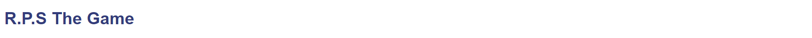
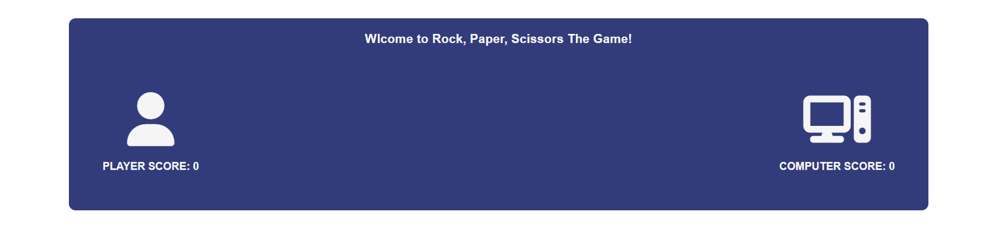
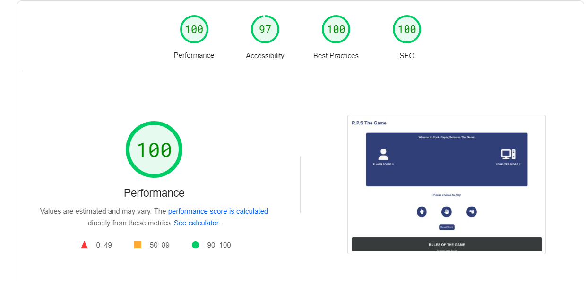

# R.P.S The Game 

R.P.S The Game is a simple game of Rock, Paper, Scissors you can play when you have some free time (or not). Rock, Paper, Scissors is a simple game so I wanted this website to reflect that, it makes it easy for any user to jump right in and start playing.  

## Features 

### Existing Features

- __Header__

  - The haeder on this website is a simple one that only includes the name of the game styled appropriately to match the rest of the website.

- __The Game Area__

  - The Game Area shows the user what side they are playing on by using icons this helps the user visualy know right away what side is the user and what side is the computer. 
  - Under the user and computer icons you have there score, the score updates every round showing the user who is winning and who is losing.
  - The Game Area also has a welcome message to let the user know what game they are playing as R.P.S might not be clear on first 
  glanse, this welcome text also changes every round to show the user who won the round.

- __The Footer__ 

  - The footer section includes the rules of the game and is very simple and easy to read.
  - I used a different colour background so that it would catch the users attention and draw them to read the rules of the game.

### Features to Implement in the future

- I would like to add a mode where you could play with a friend.
- I would like to add some throphys to give to user some milestone achievements.
- I would like to add a new game mode that gives the user 3 lives to beat the computer.

## Testing 

### Validator Testing 

- HTML
  - No errors were returned when passing through the official W3C validator.
- CSS
  - No errors were found when passing through the official W3C CSS validator.
- WebDev score
    - Score was given by official [Webdev](https://web.dev/measure/?gclid=CjwKCAjw-rOaBhA9EiwAUkLV4pZbeEVqP9vuP4NPNqvQs7TVgbh62-3Yyva7M_aGi5DsBzNf4GFicxoC6mYQAvD_BwE&url=https%3A%2F%2Fbarryk112.github.io%2Fdog-day-care%2F)

### Unfixed Bugs

Google map location can get cut out of the viewport below 770px, the map can still be used and viewed.

## Deployment

- The site was deployed to GitHub pages. 

The live link can be found here - https://barryk112.github.io/dog-day-care/

## Credits 

### Content 

- The icons used in the webpage were taken from [Font Awesome](https://fontawesome.com/)

### Media

- The photo used on the home page are from This Open Source site https://pixabay.com/
 